# Bongo4Students
The upgraded version of Bongo that uses the BongoAPI and has additional functionality and better UI. Please go to https://github.com/MpofuO/PublishedBongo/blob/main/README.md to access the readme of the version directly before this one.

## New Feature Goals
The following are the sections of the goals that this version of Bongo aims to achieve:

### New Functionality
- *Merge with friends*: Users should be able to merge their timetables with the timetables of their friends so they can easily know at what times are they all free.
- *API utilization*: The Bongo website should be completely be disconnected from the database but only connect to an API for any activities that require reading and/or writing to the database.
- *Profile Management*: Users should be able to manage and change not just their passwords but also their emails, usernames, merge keys(new), and their security questions and the answers to security questions.

### New Functionality (To be added later)
- *Find a tutor*: Bongo will be extended into a platform where students can find a tutor for any of the modules they want and the system should try to find a tutor for the student.
- *Be a tutor*: Bongo will also be a platform for students to apply to be tutors that work on standby at their own times. An opportunity for students to be tutors and work when the can and if they want to.

### Security
- *User information encryption*: Bongo now implements an api which encrypts data when data is saved or added to the database. This data is only decripted when it is sent to the website after the user is authenticated.
- *Email Utilization*: Bongo now uses emails for users to login, reset passwords and for other forms of authentication as emails are now encrypted on the database and using them is safer. Usernames are now exposed through the timetable merging feature.
- *Merge Key*: To prevent anyone from merging with anyone's timetable on the website. Bongo requires a merge key for one user to be able to merge a timetable with another. Thus one can only merge with another person's timetable at their consent. The key is used to show consent.
- Bongo now uses a custom authentication class to authenticate users as it does not sign in the user due to the complete disconnection from the database.

## Important Note
Please note the following regarding the current status of Bongo:
- We are currently working on successfully using JwtAthentication Tokens. For the time, The API has been embedded into tha application for testing the application.
- We are also working on custon user authentication. For the time, this does not work and is being dealt with. Discarding the authentication may be an option to consider in order to run the application.

## Credits
Please visit https://github.com/MpofuO/PublishedBongo#collaboration to view collaboration details of this project.

# How it Works/Looks like
The following are screenshots of the website's state showing how it works and looks like:

## Basic User Interfaces
- Homepage of the website:
  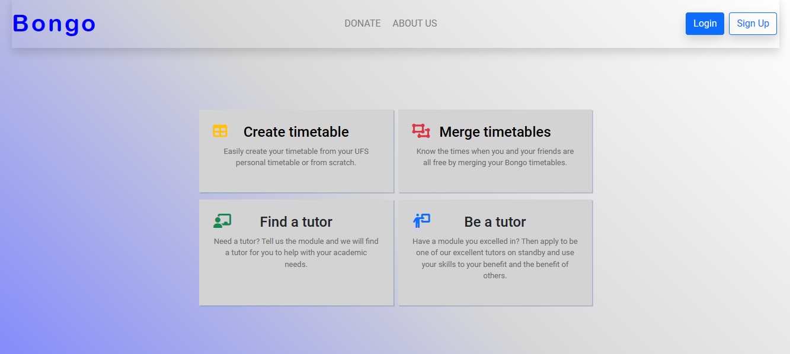
  
- Group Management:
  This page is similar to the one of handling clashes
  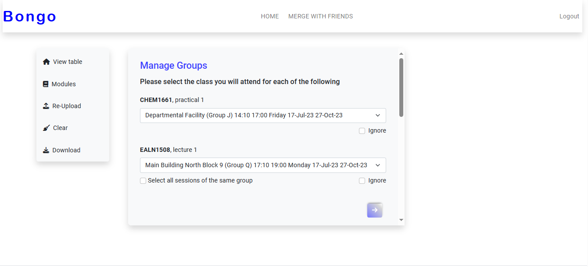

## User Account Interfaces
- Login:

  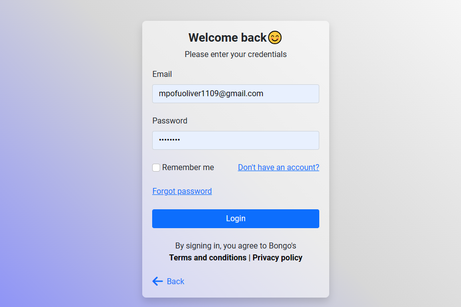

- Register:

  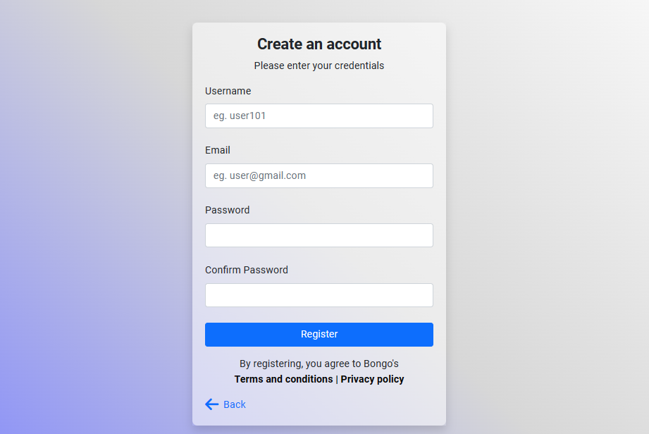
  
### Resetting Forgot Password
- Step 1: Verify Email

  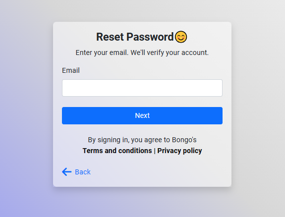
  
- Step 2: Verify it's you

  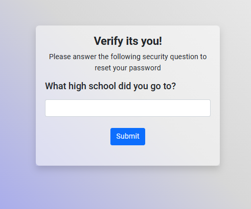
  
- Step 4: Reset Password

  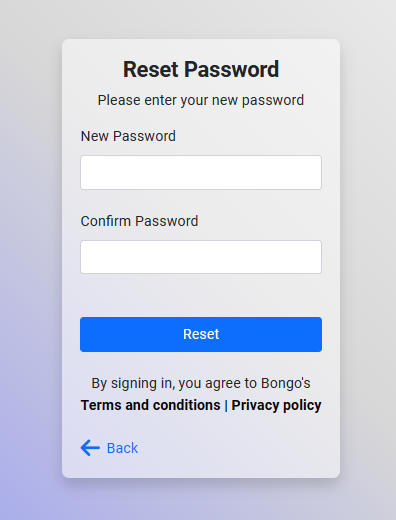

### Resetting the security question and/or answer
- The user does gets to this from the profile page:

  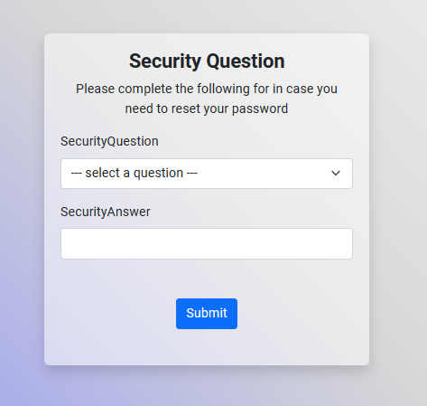

## User Interfaces:
### Profile
- The profile page of the user

  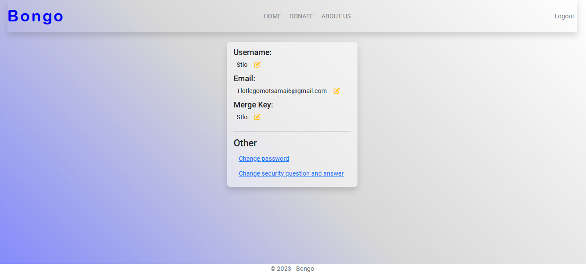
  
### Updating the profile
- Updating username:

  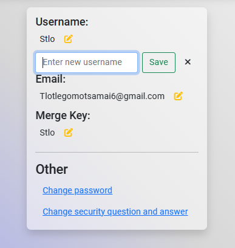
  
- Updating email:

  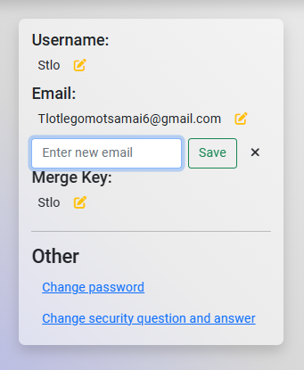

## Merging timetable Interfaces:
The following steps are followed by the user to merge their timetable with others:
- Step 1: Choose semester to merge for

  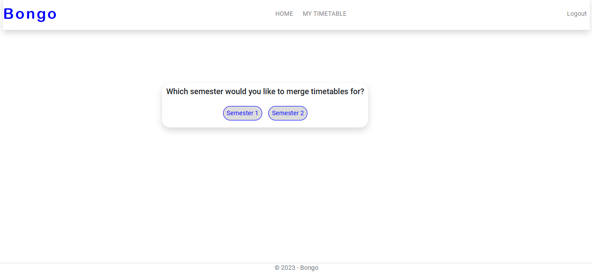

- Step 2: User is presented with their timetable but blacked out

  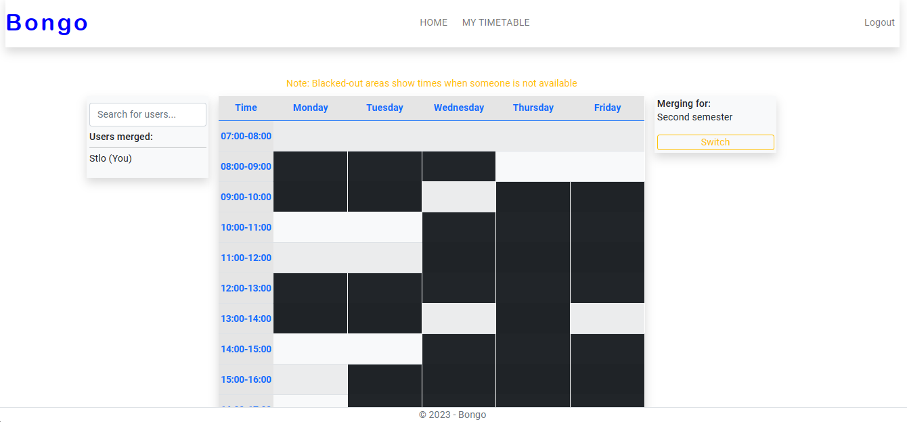

- Step 3: User searches for a user by name and selects user. Merge key is requested

  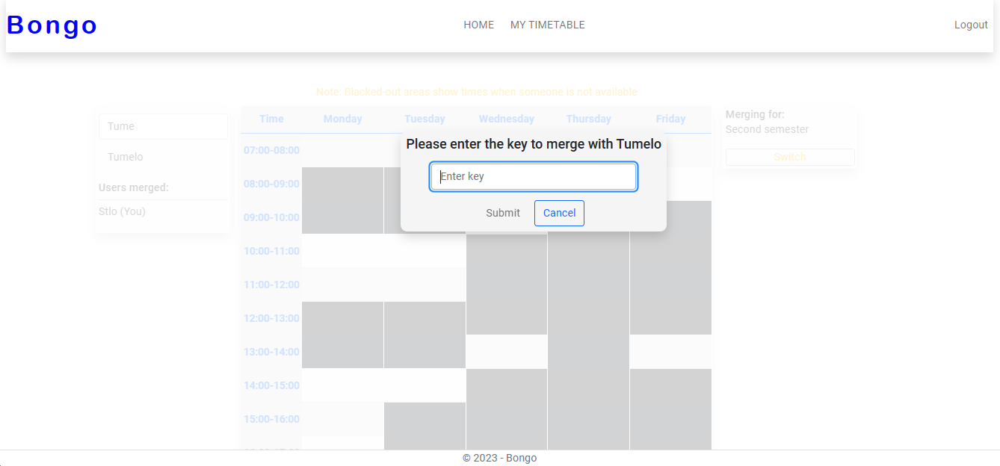

-Step 4: Submit button is enabled only when the correct key is entered

  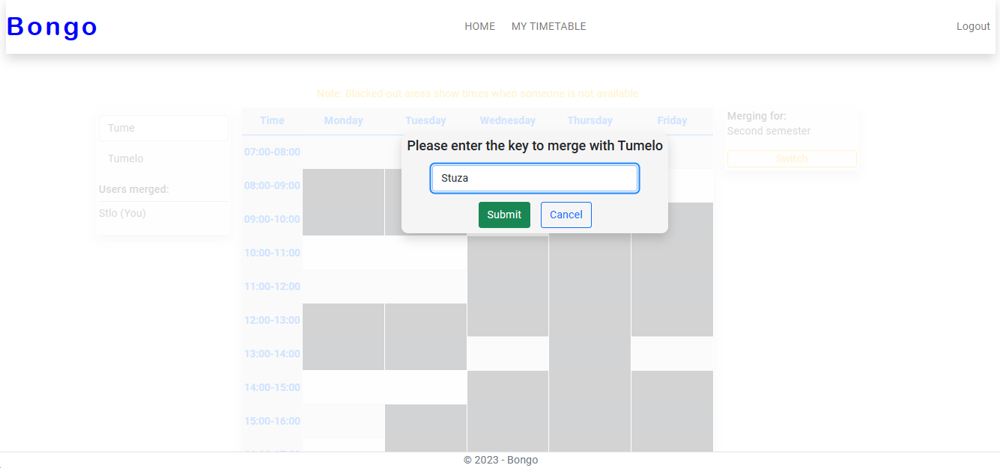

- Step 5: User merges with selected user
- 
  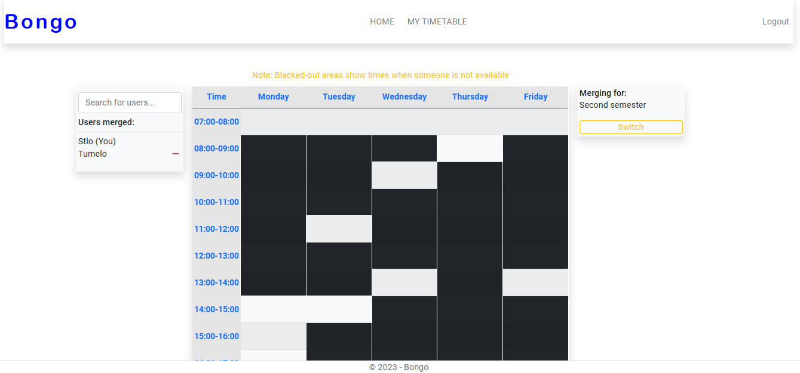

